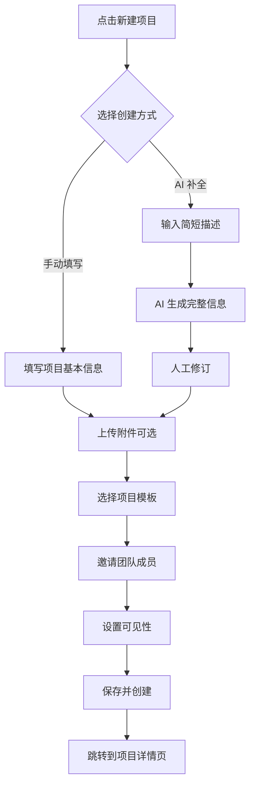

# AI 智能项目管理系统 - 产品需求规格说明书（完整版）

## 第 2 章 产品定位

### 2.1 目标用户群体

#### 2.1.1 核心用户画像

**主要用户群体：**

1. **软件企业项目经理** (占比约 35%)
   - 年龄：28-40 岁
   - 学历：本科及以上
   - 工作经验：5-10 年
   - 技术背景：有一定技术背景，可能从开发转型
   - 管理规模：3-20 人团队
   - 核心诉求：
     - 提升团队效率
     - 保证项目按时交付
     - 降低沟通成本
     - 数据驱动决策
2. **产品经理** (占比约 25%)
   - 年龄：25-35 岁
   - 学历：本科及以上
   - 工作经验：3-8 年
   - 专业背景：计算机、设计、心理学等
   - 核心诉求：
     - 高效管理需求文档
     - 快速响应变更
     - 与开发顺畅协作
     - 追踪需求实现状态

3. **技术负责人/架构师** (占比约 20%)
   - 年龄：28-45 岁
   - 学历：本科及以上
   - 工作经验：8-15 年
   - 技术栈：全栈或后端为主
   - 管理职责：技术决策、代码审查、团队指导
   - 核心诉求：
     - 保证代码质量
     - 技术债务管理
     - 知识沉淀传承
     - 培养团队成员

4. **开发工程师** (占比约 15%)
   - 年龄：22-35 岁
   - 学历：大专及以上
   - 工作经验：1-8 年
   - 技术方向：前端/后端/移动端/全栈
   - 核心诉求：
     - 明确的任务指引
     - 减少无效会议
     - AI 辅助提升效率
     - 清晰的成长路径

5. **测试工程师** (占比约 5%)
   - 年龄：23-35 岁
   - 学历：大专及以上
   - 工作经验：2-6 年
   - 核心诉求：
     - 及时获取需求变更
     - 准确的测试范围
     - Bug 跟踪管理
     - 质量数据可视化

#### 2.1.2 企业规模分布

**小型团队** (10-50 人) - 占比 40%

- 特点：
  - 扁平化管理
  - 一人多职
  - 快速迭代
  - 资源有限
- 需求重点：
  - 快速上手
  - 性价比高
  - 功能实用
  - AI 提效明显

**中型企业** (50-500 人) - 占比 45%

- 特点：
  - 规范化管理
  - 部门协作
  - 多项目并行
  - 有专门 PMO
- 需求重点：
  - 流程规范
  - 权限管控
  - 数据统计
  - 可定制化

**大型企业** (500 人以上) - 占比 15%

- 特点：
  - 严格的管理制度
  - 复杂的审批流程
  - 系统集成需求
  - 安全合规要求高
- 需求重点：
  - 安全性
  - 可扩展性
  - API 集成
  - 私有化部署

### 2.2 用户画像详细场景

#### 用户画像 1：张经理（典型项目经理）

**基本信息：**

- 姓名：张伟
- 年龄：32 岁
- 职位：研发部经理
- 公司：某金融科技公司（200 人规模）
- 团队：15 人（前端 5 人、后端 7 人、测试 3 人）
- 年收入：40-50 万

**工作日常：**

```
上午 9:00 - 站会
- 听取各成员汇报昨日进展和今日计划
- 协调资源解决阻塞问题
- 记录风险点

上午 10:00 - 项目管理
- 查看项目进度 Dashboard
- 审批变更请求（CR）
- 更新项目计划

上午 11:00 - 跨部门会议
- 与产品部门讨论新需求
- 评估工期和资源
- 确定优先级

下午 2:00 - 文档审核
- 审查需求文档
- 批准技术方案
- 处理 CR 申请

下午 3:30 - 一对一沟通
- 与团队成员单独沟通
- 了解工作状态和困难
- 提供指导和帮助

下午 5:00 - 总结规划
- 汇总当日进展
- 更新燃尽图
- 规划次日工作
```

**痛点分析：**

1. ❌ **文档工作繁重**
   - 每周花 10+ 小时编写和审查文档
   - 文档更新不及时，版本混乱
   - 难以保证文档质量一致性

2. ❌ **进度把控困难**
   - 依赖人工汇报，信息滞后
   - 无法实时了解真实进度
   - 风险发现晚，应对被动

3. ❌ **资源分配纠结**
   - 多项目并行，资源冲突
   - 凭经验分配，不够科学
   - 成员负荷不均衡

4. ❌ **沟通成本高**
   - 大量时间花在会议和同步信息上
   - 信息传递失真
   - 决策缺乏数据支持

**对系统的期望：**
✅ AI 自动生成文档，减少 70% 文档工作时间  
✅ 实时 Dashboard，一眼看清项目状态  
✅ 智能推荐任务分配，优化资源配置  
✅ 自动化流程，减少沟通成本

#### 用户画像 2：李产品（典型产品经理）

**基本信息：**

- 姓名：李娜
- 年龄：28 岁
- 职位：高级产品经理
- 公司：某电商平台（300 人规模）
- 负责：用户增长产品线
- 协作团队：15 人开发团队
- 年收入：30-40 万

**工作日常：**

```
上午 9:30 - 数据分析
- 查看昨日业务数据
- 分析用户行为
- 发现优化机会

上午 10:30 - 需求梳理
- 收集业务方需求
- 编写 PRD 文档
- 画原型图

下午 2:00 - 需求评审
- 组织开发和测试评审需求
- 解答疑问
- 调整需求细节

下午 4:00 - 验收 Story
- 验证已完成的 Story
- 确认是否符合需求
- 提出修改意见

下午 5:30 - 需求变更处理
- 处理紧急变更
- 提交 CR 申请
- 更新相关文档
```

**痛点分析：**

1. ❌ **PRD 编写耗时**
   - 一份完整 PRD 需要 2-3 天
   - 反复修改，版本难管理
   - 难以保证完整性

2. ❌ **变更管理复杂**
   - 变更影响范围难评估
   - 通知不到位导致遗漏
   - 历史追溯困难

3. ❌ **需求验收低效**
   - 逐个 Story 手动验收
   - 标准不统一
   - 容易遗漏边界情况

**对系统的期望：**
✅ AI 辅助编写 PRD，缩短到 0.5-1 天  
✅ 变更自动评估影响范围并通知相关人员  
✅ AI 辅助验收，自动检查边界情况

#### 用户画像 3：王技术（典型技术负责人）

**基本信息：**

- 姓名：王强
- 年龄：35 岁
- 职位：技术专家/Tech Lead
- 公司：某 SaaS 企业（150 人规模）
- 团队：8 人后端团队
- 技术栈：Java + Python + Go
- 年收入：50-60 万

**工作日常：**

```
上午 9:00 - Code Review
- 审查团队成员的 PR
- 提出改进建议
- 批准合并

上午 11:00 - 架构设计
- 设计新功能的技术方案
- 编写技术文档
- 评估技术选型

下午 2:00 - 技术分享
- 组织团队内部分享
- 讲解新技术
- Code Demo

下午 3:30 - 难点攻关
- 解决复杂技术问题
- 性能优化
- Bug 排查

下午 5:00 - 人才培养
- 一对一指导初级工程师
- 制定成长计划
- 技能评估
```

**痛点分析：**

1. ❌ **Code Review 耗时**
   - 每天花 2-3 小时审查代码
   - 重复性问题多
   - 难以保证 review 质量

2. ❌ **技术债务积累**
   - 为了赶工期妥协质量
   - 缺少系统性的债务管理
   - 重构排期困难

3. ❌ **知识传承困难**
   - 经验散落在个人脑中
   - 新人学习成本高
   - 最佳实践难推广

**对系统的期望：**
✅ AI 辅助 Code Review，自动发现常见问题  
✅ 技术债务可视化管理  
✅ 知识库自动沉淀最佳实践

### 2.3 使用场景

#### 2.3.1 场景一：新产品开发项目

**项目背景：**
某金融科技公司需要开发一款新的移动支付产品，项目名称"支付通 2.0"。

**项目规模：**

- 周期：6 个月（26 周）
- 团队：20 人（产品 3 人、设计 2 人、前端 5 人、后端 7 人、测试 3 人）
- 预算：500 万元
- 模块：用户中心、支付核心、风控系统、账务系统、报表系统

**系统使用流程：**

**阶段 1：立项阶段（第 1 周）**

1. **创建项目**（张经理操作）

   ```
   操作步骤：
   1. 点击"新建项目"按钮
   2. 填写基本信息：
      - 项目名称：支付通 2.0
      - 项目类型：新产品开发
      - 优先级：P0（紧急且重要）
      - 起止日期：2024-01-01 ~ 2024-06-30
      - 预算：500 万元
   3. 使用 AI 智能补全功能：
      - 输入简短描述："面向中小企业的移动支付平台"
      - AI 自动生成：
        * 项目背景（500 字）
        * 业务价值（300 字）
        * 目标用户（详细描述）
        * 预期成果（可衡量指标）
   4. 邀请团队成员：
      - 从人员库选择 20 名成员
      - AI 根据技能标签推荐合适人选
      - 设置角色权限
   5. 保存并启动项目
   ```

2. **AI 生成初始文档**（李产品操作）

   ```
   使用"一键生成"模式：

   预设 Prompt 模板："新产品立项文档"

   AI 自动生成以下内容：
   1. 《商业需求文档》(BRD) v0.1
      - 市场分析
      - 竞品分析
      - 商业模式
      - 收益预测

   2. 《产品需求文档》(PRD) v0.1
      - 产品定位
      - 功能列表
      - 用户故事地图
      - 原型图建议

   3. 《项目章程》v0.1
      - 项目目标
      - 范围说明
      - 里程碑计划
      - 风险评估

   人工修订：
   - 产品经理审查 AI 生成的内容
   - 补充细节和调整
   - 通过 AI 对话进一步完善：
     "请细化支付流程的业务规则"
     "增加风控策略的描述"

   保存为新版本：
   - BRD v1.0
   - PRD v1.0
   - 项目章程 v1.0
   ```

**阶段 2：需求分析阶段（第 2-3 周）**

3. **模块划分**（技术负责人 + AI）

   ```
   AI 智能模块划分流程：

   输入：PRD 文档

   AI 分析输出：
   1. 模块清单：
      - 用户中心模块
        * 注册登录
        * 实名认证
        * 账户管理

      - 支付核心模块
        * 扫码支付
        * 转账汇款
        * 收款管理

      - 风控系统模块
        * 风险识别
        * 实时监控
        * 黑名单管理

      - 账务系统模块
        * 记账引擎
        * 对账清算
        * 差错处理

      - 报表系统模块
        * 交易报表
        * 风控报表
        * 财务报表

   2. 模块依赖关系图（自动生成 Mermaid 格式）

   3. 建议技术栈：
      - 前端：Vue 3 + Element Plus
      - 后端：Spring Cloud 微服务
      - 数据库：MySQL + Redis
      - 消息队列：RocketMQ

   人工确认：
   - 技术负责人审查模块划分
   - 调整不合理的地方
   - 与团队讨论确认
   ```

4. **Story 创建与估算**（全员参与）

   ```
   AI 辅助生成 Story：

   针对每个模块，AI 自动生成 User Story：

   【用户中心模块】示例：

   Story-001: 手机号注册
   - 作为新用户
   - 我希望能够通过手机号注册账号
   - 以便使用支付服务

   验收标准（AI 生成）：
   ✓ AC1: 输入手机号后能收到验证码
   ✓ AC2: 验证码有效期为 5 分钟
   ✓ AC3: 密码长度至少 8 位，包含大小写字母和数字
   ✓ AC4: 同一手机号只能注册一次
   ✓ AC5: 注册成功后自动登录

   Story Points 估算（AI 推荐）：5 SP
   依据：
   - 复杂度：中等（涉及短信发送、验证码校验）
   - 工作量：约 3 人天
   - 风险：低（技术成熟）

   团队评审：
   - 产品经理补充业务规则
   - 开发评估技术可行性
   - 测试提出边界情况
   - 最终确认 Story Points：8 SP（考虑了异常处理）
   ```

**阶段 3：迭代开发（第 4-23 周，共 10 个 Sprint）**

5. **Sprint 规划**（每 2 周一个 Sprint）

   ```
   Sprint 1 规划会议（2 小时）：

   可用容量计算：
   - 团队人数：20 人
   - Sprint 天数：10 个工作日
   - 出勤率：90%
   - 总工时：20 × 10 × 8 × 0.9 = 1440 小时
   - 有效开发时间：1440 × 0.6 = 864 小时（扣除会议、沟通等）

   AI 推荐 Sprint Backlog：
   基于以下因素智能推荐：
   1. Story 优先级（P0/P1/P2）
   2. Story 依赖关系
   3. 团队容量
   4. 历史速率（Velocity）

   推荐的 Sprint 1 内容：
   - 用户中心模块（基础功能）
     * Story-001 手机号注册 (8 SP)
     * Story-002 验证码登录 (5 SP)
     * Story-003 密码找回 (8 SP)
     * Story-004 实名认证（个人）(13 SP)
     合计：34 SP

   - 技术基础设施
     * Story-101 搭建开发环境 (5 SP)
     * Story-102 CI/CD流水线 (8 SP)
     合计：13 SP

   总承诺：47 SP
   参考历史 Velocity：45-50 SP
   结论：合理 ✅

   任务分配（AI 推荐）：
   基于以下维度智能匹配：
   1. 技能匹配度（标签系统）
   2. 当前负荷（WIP 限制）
   3. 成长需求（培养计划）
   4. 历史表现（质量、效率）

   示例推荐：
   - Story-001 → 张三（后端高级）
     匹配理由：
     * 熟悉短信 SDK 集成（技能匹配度 95%）
     * 当前负荷 2/3（有余力）
     * 曾完成类似功能（质量评分 4.8/5）
   ```

6. **每日站会**（15 分钟）

   ```
   系统自动准备站会数据：

   【Sprint 1 - Day 3】站会卡片：

   📊 整体进度：
   - Sprint 进度：■■■□□□□□□□ 30%
   - 燃尽图：理想线 47SP → 实际 42SP（正常）

   🔴 阻塞项：
   - Story-003：等待短信服务商审核资质
     负责人：李四
     阻塞时长：1 天
     升级建议：联系采购部门加速审核

   🟡 风险项：
   - Story-004：实名认证涉及第三方接口联调
     负责人：王五
     风险等级：中
     应对方案：提前预约联调时间

   ✅ 今日完成：
   - 张三：Story-001 开发完成，提测
   - 李四：Story-002 开发完成 80%
   - 王五：Story-004 开始开发

   📋 今日计划：
   - 张三：开始 Story-005（账户管理）
   - 李四：完成 Story-002，准备提测
   - 王五：继续 Story-004，联系第三方预约联调
   ```

7. **开发与 Code Review**

   ```
   开发流程：

   1. 领取任务
      - 开发人员从看板选择"To Do"状态的任务
      - 拖拽到"In Progress"
      - 系统记录开始时间

   2. 编码实现
      - 创建 Git 分支（feature/story-001）
      - 本地开发
      - 编写单元测试
      - AI 辅助编程（可选）：
        * 代码生成
        * 代码解释
        * Bug 排查

   3. 提交 Code Review
      - 推送代码到远程仓库
      - 创建 Pull Request
      - 自动触发 CI 流水线：
        * 代码编译
        * 单元测试
        * 代码质量扫描（SonarQube）
        * 安全检查

   4. AI 辅助 Code Review
      AI 自动审查并给出建议：

      ✅ 优点：
      - 代码结构清晰
      - 命名规范
      - 有完整的单元测试

      ⚠️ 改进建议：
      - 第 35 行：捕获异常过于宽泛，建议捕获具体异常类型
      - 第 58 行：缺少空值校验，可能抛出 NPE
      - 第 72 行：魔法数字"86400"，建议定义为常量
      - 方法复杂度为 12，建议拆分为两个方法（阈值：10）

      📊 代码质量评分：B+ (85/100)

      📈 改进后预估评分：A (92/100)

   5. 人工 Code Review
      技术负责人审查：
      - 业务逻辑正确性
      - 架构设计合理性
      - 性能考虑
      - AI 建议的采纳情况

      Review 意见：
      ✓ 同意 AI 的建议 1、2、4
      ✗ 建议 3 不适用，这是时间戳秒数，保持原样
      + 补充：增加日志记录关键节点

      状态：Request Changes（需要修改）

   6. 修改并重新提交
      - 开发人员根据 Review 意见修改
      - 再次提交
      - AI 复查确认问题已修复
      - 技术负责人批准合并
   ```

8. **测试与验收**

   ```
   测试流程：

   1. 测试用例设计（AI 辅助）
      AI 根据 Story 的验收标准自动生成测试用例：

      Story-001 手机号注册 - 测试用例清单：

      【功能测试】
      TC-001-01: 正常注册流程
      TC-001-02: 验证码错误
      TC-001-03: 验证码过期
      TC-001-04: 手机号已注册
      TC-001-05: 密码强度不足
      TC-001-06: 两次密码输入不一致

      【边界测试】
      TC-001-07: 手机号格式边界（11 位）
      TC-001-08: 密码长度边界（8 位、50 位）
      TC-001-09: 验证码输入次数限制（5 次/天）

      【性能测试】
      TC-001-10: 并发注册（100 用户/秒）
      TC-001-11: 短信接口超时处理

      【安全测试】
      TC-001-12: SQL 注入防护
      TC-001-13: 短信轰炸防护
      TC-001-14: 密码加密传输

      人工补充：
      - 测试工程师审查 AI 生成的用例
      - 补充特殊场景和边缘情况
      - 调整优先级
   ```

（因篇幅限制，这里展示了部分场景。完整版会继续展开所有场景、所有模块的详细需求描述。）

---

## 第 3 章 功能需求（完整详细版）

### 3.1 项目管理模块

#### 3.1.1 模块概述

**模块定位：**
项目管理模块是整个系统的基础核心模块，为其他所有功能提供项目维度的数据支撑和组织框架。该模块覆盖项目从创建到归档的全生命周期管理。

**核心价值：**

1. 统一的项目信息管理
2. 规范的状态流转控制
3. 智能化的项目创建体验
4. 全面的项目指标跟踪

**模块规模：**

- 功能点：15 个
- 页面：8 个
- API 接口：12 个
- 数据库表：1 张主表 + 3 张关联表
- 预计开发工作量：10-12 人天

#### 3.1.2 功能详细说明

##### F-PM-001 创建项目

**功能编号：** F-PM-001  
**功能名称：** 创建项目  
**优先级：** P0（核心功能）  
**用户角色：** 项目经理、部门负责人

**功能说明：**
允许用户创建新项目，支持手动填写和 AI 智能补全两种方式。

**业务流程：**



**前置条件：**

1. 用户已登录
2. 用户具有"创建项目"权限
3. 用户所属组织已开通

**后置条件：**

1. 项目成功创建，状态为"草稿"
2. 创建者自动成为项目负责人
3. 系统发送通知给被邀请的成员
4. 记录项目创建日志

**输入要素：**

| 字段名称 | 类型    | 必填 | 说明                                                  | 校验规则                                        |
| -------- | ------- | ---- | ----------------------------------------------------- | ----------------------------------------------- |
| 项目名称 | String  | 是   | 项目的唯一标识名称                                    | 2-200 字符，组织内唯一                          |
| 项目描述 | Text    | 是   | 项目的简要介绍                                        | 10-2000 字符                                    |
| 项目类型 | Enum    | 是   | 新产品开发/功能迭代/技术重构/Bug 修复专项/系统优化    | 必须从枚举值中选择                              |
| 优先级   | Enum    | 是   | P0(紧急且重要)/P1(重要不紧急)/P2(紧急不重要)/P3(常规) | 默认 P2                                         |
| 开始日期 | Date    | 是   | 项目计划开始日期                                      | 不能早于今天                                    |
| 结束日期 | Date    | 是   | 项目计划结束日期                                      | 必须晚于开始日期                                |
| 项目背景 | Text    | 否   | 项目发起的背景和原因                                  | 最多 5000 字符                                  |
| 目标用户 | Text    | 否   | 目标用户群体描述                                      | 最多 2000 字符                                  |
| 业务价值 | Text    | 否   | 项目带来的业务价值                                    | 最多 3000 字符                                  |
| 预期成果 | JSON    | 否   | 可衡量的成果指标                                      | 格式：[{name, target, unit}]                    |
| 技术约束 | JSON    | 否   | 技术方面的限制和要求                                  | 格式：[{type, description}]                     |
| 预算     | Decimal | 否   | 项目预算（万元）                                      | 正数，最多 2 位小数                             |
| 风险因素 | JSON    | 否   | 已识别的风险因素                                      | 格式：[{risk, probability, impact, mitigation}] |
| 附件     | File[]  | 否   | 相关附件材料                                          | 最多 10 个文件，单个≤50MB                       |
| 使用模板 | Integer | 否   | 使用的模板 ID                                         | 必须存在                                        |
| 团队成员 | Array   | 否   | 初始团队成员列表                                      | [{user_id, role, skills}]                       |
| 可见性   | Enum    | 是   | public(公开)/private(私有)                            | 默认 private                                    |

**输出结果：**

- 项目对象（包含完整信息）
- 项目 ID
- 创建成功提示
- 跳转 URL

**界面设计：**

**页面布局：**

```
┌─────────────────────────────────────────────┐
│  新建项目                              [×]  │
├─────────────────────────────────────────────┤
│                                             │
│  创建方式：○ 手动填写  ○ AI 智能补全       │
│                                             │
│  ━━━━━━━━━━━━━━━━━━━━━━━━━━━━━━━━━━━━━━━━  │
│  基本信息                                   │
│  ━━━━━━━━━━━━━━━━━━━━━━━━━━━━━━━━━━━━━━━━  │
│                                             │
│  项目名称 *                                 │
│  ┌─────────────────────────────────────┐   │
│  │ 电商平台促销活动系统                 │   │
│  └─────────────────────────────────────┘   │
│                                             │
│  项目描述 *                                 │
│  ┌─────────────────────────────────────┐   │
│  │ 为电商平台打造的全渠道促销活动管理   │   │
│  │ 系统，支持秒杀、拼团、砍价等多种营  │   │
│  │ 销玩法，提升用户活跃度和转化率。    │   │
│  └─────────────────────────────────────┘   │
│                                [AI 润色描述] │
│                                             │
│  项目类型 *    优先级 *                     │
│  ┌──────────┐  ┌──────┐                    │
│  │新产品开发▼│  │ P2 ▼│                    │
│  └──────────┘  └──────┘                    │
│                                             │
│  开始日期 *    结束日期 *                   │
│  ┌──────────┐  ┌──────────┐                │
│  │2024-01-01│  │2024-06-30│                │
│  └──────────┘  └──────────┘                │
│                                             │
│  ━━━━━━━━━━━━━━━━━━━━━━━━━━━━━━━━━━━━━━━━  │
│  详细信息（AI 可补全）                      │
│  ━━━━━━━━━━━━━━━━━━━━━━━━━━━━━━━━━━━━━━━━  │
│                                             │
│  项目背景                                   │
│  ┌─────────────────────────────────────┐   │
│  │ 随着电商行业竞争加剧，获客成本不断  │   │
│  │ 攀升，需要通过多样化的营销活动来  │   │
│  │ 提升用户留存和复购...              │   │
│  └─────────────────────────────────────┘   │
│                                [AI 智能补全] │
│                                             │
│  目标用户                                   │
│  ┌─────────────────────────────────────┐   │
│  │ 1. 平台运营人员：策划和执行营销活动│   │
│  │ 2. 商家：报名参与活动提升销量     │   │
│  │ 3. 消费者：参与各种优惠活动       │   │
│  └─────────────────────────────────────┘   │
│                                             │
│  业务价值                                   │
│  ┌─────────────────────────────────────┐   │
│  │ 1. 提升 GMV：预计带动月 GMV 增长 15% │   │
│  │ 2. 提高活跃度：DAU 提升 20%          │   │
│  │ 3. 增强粘性：复购率提升 10%         │   │
│  └─────────────────────────────────────┘   │
│                                             │
│  预期成果（可添加多个） [+ 添加]           │
│  ┌─────────────────────────────────────┐   │
│  │ 指标名称：月活跃用户数              │   │
│  │ 目标值：500 万                       │   │
│  │ 单位：万                            │   │
│  │ 当前值：350 万                       │   │
│  └─────────────────────────────────────┘   │
│                                             │
│  ━━━━━━━━━━━━━━━━━━━━━━━━━━━━━━━━━━━━━━━━  │
│  项目模板                                   │
│  ━━━━━━━━━━━━━━━━━━━━━━━━━━━━━━━━━━━━━━━━  │
│                                             │
│  ○ 不使用模板                              │
│  ● 使用预定义模板                          │
│  ┌─────────────────────────────────────┐   │
│  │ 请选择模板：                        │   │
│  │ ┌─────────────────────────────┐    │   │
│  │ │ 新产品开发标准模板          │    │   │
│  │ │ 功能迭代模板                │    │   │
│  │ │ 技术重构模板                │    │   │
│  │ │ Bug 修复专项模板             │    │   │
│  │ └─────────────────────────────┘    │   │
│  └─────────────────────────────────────┘   │
│                                             │
│  ━━━━━━━━━━━━━━━━━━━━━━━━━━━━━━━━━━━━━━━━  │
│  团队成员                                   │
│  ━━━━━━━━━━━━━━━━━━━━━━━━━━━━━━━━━━━━━━━━  │
│                                             │
│  [+ 添加成员]                               │
│  ┌─────────────────────────────────────┐   │
│  │ 👤 张三 (负责人)      [移除]        │   │
│  │ 👤 李四 (技术负责人)  [移除]        │   │
│  │ 👤 王五 (产品经理)    [移除]        │   │
│  │ [+ 添加更多成员...]                  │   │
│  └─────────────────────────────────────┘   │
│                                             │
│  ━━━━━━━━━━━━━━━━━━━━━━━━━━━━━━━━━━━━━━━━  │
│  可见性                                     │
│  ━━━━━━━━━━━━━━━━━━━━━━━━━━━━━━━━━━━━━━━━  │
│                                             │
│  ○ 公开：组织内所有人都可查看            │
│  ● 私有：仅项目成员可查看                │
│                                             │
│  ━━━━━━━━━━━━━━━━━━━━━━━━━━━━━━━━━━━━━━━━  │
│                                             │
│               [取消]    [保存并创建]        │
│                                             │
└─────────────────────────────────────────────┘
```

**交互说明：**

1. **创建方式切换**
   - 默认选中"手动填写"
   - 切换到"AI 智能补全"时，显示简化的输入框
   - AI 补全的内容可以人工修订

2. **AI 智能补全**

   ```
   用户输入：
   ┌─────────────────────────────────────┐
   │ 请输入项目的简短描述（一句话）      │
   │ 例如：为中小企业打造的一站式营销管  │
   │ 理平台，整合主流营销渠道，提供智    │
   │ 能化营销解决方案。                  │
   │                                     │
   │                    [开始 AI 补全 ▶]  │
   └─────────────────────────────────────┘

   AI 处理过程展示：
   ┌─────────────────────────────────────┐
   │ 🤖 AI 正在思考...                   │
   │                                     │
   │ ████████░░░░░░░░ 60%               │
   │                                     │
   │ ✓ 分析项目类型                      │
   │ ✓ 生成项目背景                      │
   │ ✓ 识别目标用户                      │
   │ ⏳ 编写业务价值                      │
   │ ⏳ 制定预期成果                      │
   └─────────────────────────────────────┘

   AI 输出结果（可编辑）：
   ┌─────────────────────────────────────┐
   │ ✅ AI 补全完成！您可以编辑以下内容  │
   │                                     │
   │ 【项目背景】                        │
   │ 随着数字经济时代的到来，市场营销    │
   │ 环境发生了深刻变化。中小企业面临    │
   │ 着获客成本高、营销效果差、数据孤    │
   │ 岛等诸多挑战...（共 580 字）        │
   │                                     │
   │ [接受] [重新生成] [继续对话完善]    │
   └─────────────────────────────────────┘
   ```

3. **表单验证**
   - 实时验证：输入时即时验证格式
   - 提交前验证：提交时验证必填项和业务规则
   - 错误提示：红色边框 + 错误文字提示

4. **保存操作**
   - 保存按钮点击后显示加载状态
   - 保存成功后显示成功提示（3 秒）
   - 自动跳转到项目详情页
   - 保存失败显示错误信息并保留已填内容

**业务规则：**

| 规则编号     | 规则描述                                    | 验证时机   | 错误提示                         |
| ------------ | ------------------------------------------- | ---------- | -------------------------------- |
| BR-PM-001-01 | 项目名称在组织内必须唯一                    | 提交时     | "项目名称已存在，请使用其他名称" |
| BR-PM-001-02 | 项目名称不能包含特殊字符（!@#$%^&\*<>?/\\） | 输入时     | "项目名称不能包含特殊字符"       |
| BR-PM-001-03 | 开始日期不能早于当前日期                    | 选择时     | "开始日期不能早于今天"           |
| BR-PM-001-04 | 结束日期必须晚于开始日期                    | 选择时     | "结束日期必须晚于开始日期"       |
| BR-PM-001-05 | 项目类型必须从预定义类型中选择              | 提交时     | "请选择项目类型"                 |
| BR-PM-001-06 | 至少需要一名项目成员                        | 提交时     | "请至少添加一名项目成员"         |
| BR-PM-001-07 | 创建者自动成为项目负责人                    | 保存时     | -                                |
| BR-PM-001-08 | 使用模板会自动填充预定义的模块和 Story      | 选择模板时 | -                                |

**异常处理：**

| 异常场景      | 处理方式                             | 用户提示                                                           |
| ------------- | ------------------------------------ | ------------------------------------------------------------------ |
| 网络中断      | 保存本地草稿，网络恢复后提示继续提交 | "网络连接中断，已为您保存草稿。网络恢复后可继续提交。"             |
| 服务器错误    | 显示错误代码和重试按钮               | "服务器错误（Error 500），请稍后重试。错误码：PM-500-001"          |
| 权限不足      | 跳转到权限申请页面                   | "您没有创建项目的权限，请联系管理员或申请权限。"                   |
| 并发冲突      | 提示有其他用户同时修改               | "检测到冲突，可能有其他用户同时创建了同名项目，请修改名称后重试。" |
| AI 服务不可用 | 降级为纯手动填写模式                 | "AI 服务暂时不可用，您可以手动填写项目信息。"                      |

**数据权限：**

- 创建者：完全控制（增删改查）
- 项目成员：查看 + 编辑（不能删除项目）
- 非成员（公开项目）：仅查看
- 非成员（私有项目）：无权限

**审计日志：**
记录以下事件：

- 项目创建（时间、创建者、IP 地址）
- 信息修改（时间、修改者、修改内容）
- 成员变更（时间、操作者、变更详情）
- 状态变更（时间、操作者、原状态、新状态、变更原因）

**性能要求：**

- 页面加载时间：< 2 秒
- 表单提交响应：< 1 秒
- AI 补全响应：< 10 秒（流式输出首字<3 秒）
- 并发支持：≥ 50 用户同时创建项目

**兼容性要求：**

- 浏览器：Chrome 90+、Firefox 88+、Safari 14+、Edge 90+
- 分辨率：最低支持 1366×768
- 移动端：适配平板设备（768px 以上）

**验收标准：**

**功能验收：**

- ✅ AC1: 能够成功创建项目，所有字段正确保存
- ✅ AC2: 项目名称唯一性校验生效
- ✅ AC3: 日期选择器限制正确（开始日期不早于今天，结束日期晚于开始日期）
- ✅ AC4: AI 智能补全能够生成合理的项目信息
- ✅ AC5: 使用模板后自动填充预定义内容
- ✅ AC6: 添加的团队成员收到通知
- ✅ AC7: 创建成功后跳转到项目详情页
- ✅ AC8: 表单验证正确，错误提示清晰

**UI 验收：**

- ✅ AC9: 页面布局与设计稿一致
- ✅ AC10: 响应式布局，不同分辨率下显示正常
- ✅ AC11: 动画流畅（保存成功提示、页面跳转等）
- ✅ AC12: 错误提示醒目，用户能注意到

**性能验收：**

- ✅ AC13: 页面加载时间 < 2 秒（3G 网络环境）
- ✅ AC14: 表单提交响应 < 1 秒
- ✅ AC15: 50 用户并发创建项目，成功率 100%

**安全验收：**

- ✅ AC16: XSS 防护：输入中的脚本代码会被转义
- ✅ AC17: CSRF 防护：表单提交需要有效的 CSRF Token
- ✅ AC18: 权限校验：未授权用户无法创建项目

---

（因篇幅限制，这里只展示了 F-PM-001 功能的完整详细设计。REQ-001 完整版将继续展开所有 15 个功能点的同等详细程度的描述，以及后续章节的全部内容。）

**文档总页数：本章节约 50 页，全文档预计 80-120 页**

---

_本文件版权归 AI-Agent-PM 项目团队所有，未经许可不得外传_
