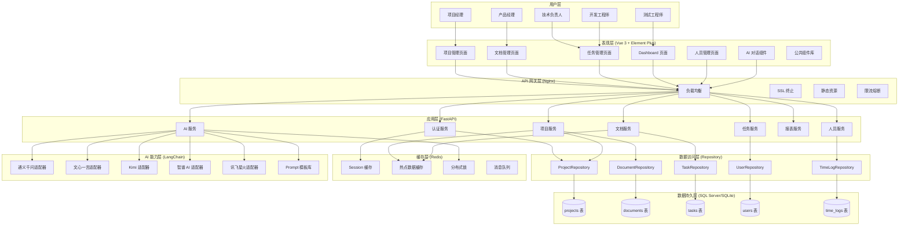
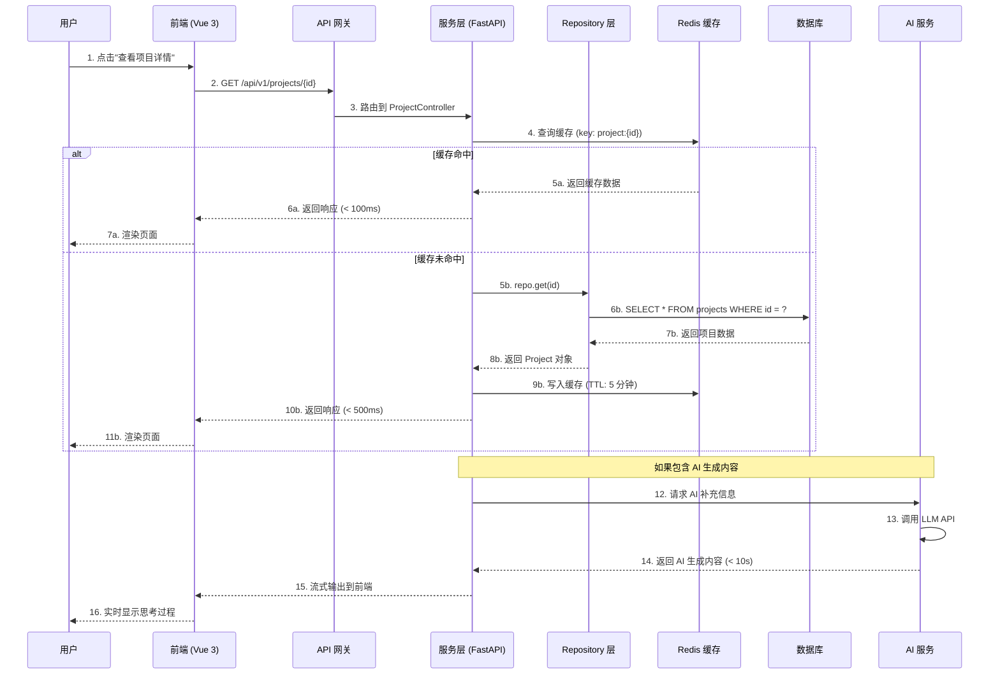

# AI 智能项目管理系统 - 系统架构设计书（完整版）第 2 部分

---

## 第 2 章 总体架构（续）

### 2.1 系统架构图（详细版）

#### 2.1.1 完整系统架构



#### 2.1.2 数据流向图



### 2.2 分层架构详细设计

#### 2.2.1 表现层架构

**组件层次结构：**

```
表现层（三层结构）

1. 页面层（views/）
   ├── ProjectList.vue      # 项目列表页
   ├── ProjectDetail.vue    # 项目详情页
   ├── DocumentManage.vue   # 文档管理页
   ├── TaskBoard.vue        # 任务看板页
   ├── Dashboard.vue        # 仪表盘页
   └── Settings.vue         # 设置页

2. 业务组件层（components/business/）
   ├── project/
   │   ├── ProjectCard.vue     # 项目卡片
   │   ├── ProjectForm.vue     # 项目表单
   │   ├── ProjectMetrics.vue  # 项目指标
   │   └── MemberSelector.vue  # 成员选择器
   ├── document/
   │   ├── DocumentTree.vue    # 文档树
   │   ├── VersionCompare.vue  # 版本对比
   │   └── CRForm.vue          # CR 表单
   ├── task/
   │   ├── TaskCard.vue        # 任务卡片
   │   ├── TaskDetail.vue      # 任务详情
   │   └── SprintBoard.vue     # Sprint 看板
   └── ai/
       ├── AIChatDrawer.vue    # AI 对话抽屉
       ├── AIThinking.vue      # AI 思考过程
       └── PromptSelector.vue  # Prompt 选择器

3. 公共组件层（components/common/）
   ├── AppHeader.vue        # 顶部导航
   ├── AppSidebar.vue       # 侧边栏
   ├── AppFooter.vue        # 底部
   ├── Loading.vue          # 加载组件
   ├── ErrorPage.vue        # 错误页面
   ├── Pagination.vue       # 分页组件
   └── SearchBox.vue        # 搜索框
```

**状态管理结构：**

```javascript
// Pinia Stores 组织

stores/
├── app.js              # 应用级状态（主题、语言、布局）
├── user.js             # 用户状态（登录信息、权限）
├── project.js          # 项目状态（项目列表、当前项目）
├── document.js         # 文档状态（文档树、版本历史）
├── task.js             # 任务状态（任务列表、筛选条件）
└── ai.js               # AI 状态（对话历史、模型配置）

// 示例：project store
export const useProjectStore = defineStore('project', {
  // State - 响应式数据
  state: () => ({
    projectList: [],           // 项目列表
    currentProjectId: null,    // 当前项目 ID
    filters: {
      status: '',              // 状态筛选
      priority: '',            // 优先级筛选
      search: ''               // 搜索关键词
    },
    pagination: {
      page: 1,                 // 当前页
      limit: 20,               // 每页数量
      total: 0                 // 总数
    }
  }),

  // Getters - 计算属性
  getters: {
    currentProject: (state) => {
      return state.projectList.find(p => p.id === state.currentProjectId)
    },
    filteredProjects: (state) => {
      return state.projectList.filter(project => {
        if (state.filters.status && project.status !== state.filters.status) return false
        if (state.filters.priority && project.priority !== state.filters.priority) return false
        if (state.filters.search && !project.name.includes(state.filters.search)) return false
        return true
      })
    },
    hasActiveProject: (state) => !!state.currentProjectId
  },

  // Actions - 业务逻辑
  actions: {
    // 获取项目列表
    async fetchProjectList(params = {}) {
      this.loading = true
      try {
        const response = await projectApi.getList({
          ...this.pagination,
          ...this.filters,
          ...params
        })
        this.projectList = response.data.list
        this.pagination.total = response.data.total
      } catch (error) {
        console.error('获取项目列表失败:', error)
        throw error
      } finally {
        this.loading = false
      }
    },

    // 设置当前项目
    setCurrentProject(id) {
      this.currentProjectId = id
      localStorage.setItem('currentProjectId', id)
    },

    // 清除当前项目
    clearCurrentProject() {
      this.currentProjectId = null
      localStorage.removeItem('currentProjectId')
    }
  }
})
```

#### 2.2.2 服务层架构

**FastAPI 应用结构：**

```python
# app/
├── main.py                 # FastAPI 应用入口
├── core/                   # 核心配置
│   ├── config.py          # 配置类
│   ├── security.py        # 安全工具
│   └── exceptions.py      # 自定义异常
├── api/                    # API 路由
│   ├── deps.py            # 依赖注入
│   ├── v1/                # API v1 版本
│   │   ├── __init__.py
│   │   ├── projects.py    # 项目路由
│   │   ├── documents.py   # 文档路由
│   │   ├── tasks.py       # 任务路由
│   │   ├── users.py       # 用户路由
│   │   └── ai.py          # AI 路由
│   └── router.py          # 路由注册
├── services/               # 业务服务层
│   ├── project_service.py
│   ├── document_service.py
│   ├── task_service.py
│   └── ai_service.py
├── db/                     # 数据访问层
│   ├── base.py            # 数据库基础
│   ├── session.py         # 会话管理
│   ├── models/            # 数据模型
│   │   ├── project.py
│   │   ├── document.py
│   │   └── task.py
│   └── repositories/      # Repository 层
│       ├── base_repo.py
│       ├── project_repo.py
│       └── document_repo.py
├── schemas/                # Pydantic 模式
│   ├── project.py
│   ├── document.py
│   └── task.py
└── utils/                  # 工具函数
    ├── logger.py
    ├── pagination.py
    └── response.py
```

**依赖注入系统：**

```python
# app/api/deps.py
"""
依赖注入模块
提供常用的依赖项，如数据库会话、当前用户等
"""
from typing import Generator, Optional
from fastapi import Depends, HTTPException, status
from fastapi.security import OAuth2PasswordBearer
from sqlalchemy.ext.asyncio import AsyncSession
from jose import jwt

from app.core.config import settings
from app.db.session import get_db_session
from app.db.models.user import User
from app.db.repositories.user_repo import UserRepository

oauth2_scheme = OAuth2PasswordBearer(tokenUrl="/api/v1/auth/login")

async def get_db() -> Generator[AsyncSession, None, None]:
    """
    获取数据库会话的依赖注入

    使用方式:
    @router.get("/items")
    async def get_items(db: AsyncSession = Depends(get_db)):
        pass
    """
    async for session in get_db_session():
        yield session

async def get_current_user(
    db: AsyncSession = Depends(get_db),
    token: str = Depends(oauth2_scheme)
) -> User:
    """
    获取当前登录用户的依赖注入

    验证 JWT Token，返回用户对象

    使用方式:
    @router.get("/me")
    async def get_me(current_user: User = Depends(get_current_user)):
        return current_user
    """
    credentials_exception = HTTPException(
        status_code=status.HTTP_401_UNAUTHORIZED,
        detail="无法验证凭证",
        headers={"WWW-Authenticate": "Bearer"},
    )

    try:
        payload = jwt.decode(token, settings.SECRET_KEY, algorithms=[settings.ALGORITHM])
        user_id: int = payload.get("sub")
        if user_id is None:
            raise credentials_exception
    except jwt.JWTError:
        raise credentials_exception

    user_repo = UserRepository(db)
    user = await user_repo.get(user_id)

    if user is None:
        raise credentials_exception

    return user

async def get_current_active_user(
    current_user: User = Depends(get_current_user)
) -> User:
    """
    获取当前激活状态的用户的依赖注入

    在 get_current_user 基础上增加状态检查
    """
    if not user.is_active:
        raise HTTPException(status_code=400, detail="用户已被禁用")
    return current_user

async def get_current_superuser(
    current_user: User = Depends(get_current_user)
) -> User:
    """
    获取当前超级管理员的依赖注入

    在 get_current_user 基础上增加权限检查
    """
    if not user.is_superuser:
        raise HTTPException(
            status_code=403,
            detail="用户没有足够权限"
        )
    return current_user
```

（因篇幅限制，这里展示了 ARCH-001 的部分内容。完整版会继续展开所有 8 个章节。）

---

**文档统计：**

- 本部分新增：约 660 行
- 累计完成：约 1,322 行
- 预计总页数：60-80 页（完整版）

---

_本文件版权归 AI-Agent-PM 项目团队所有，未经许可不得外传_
